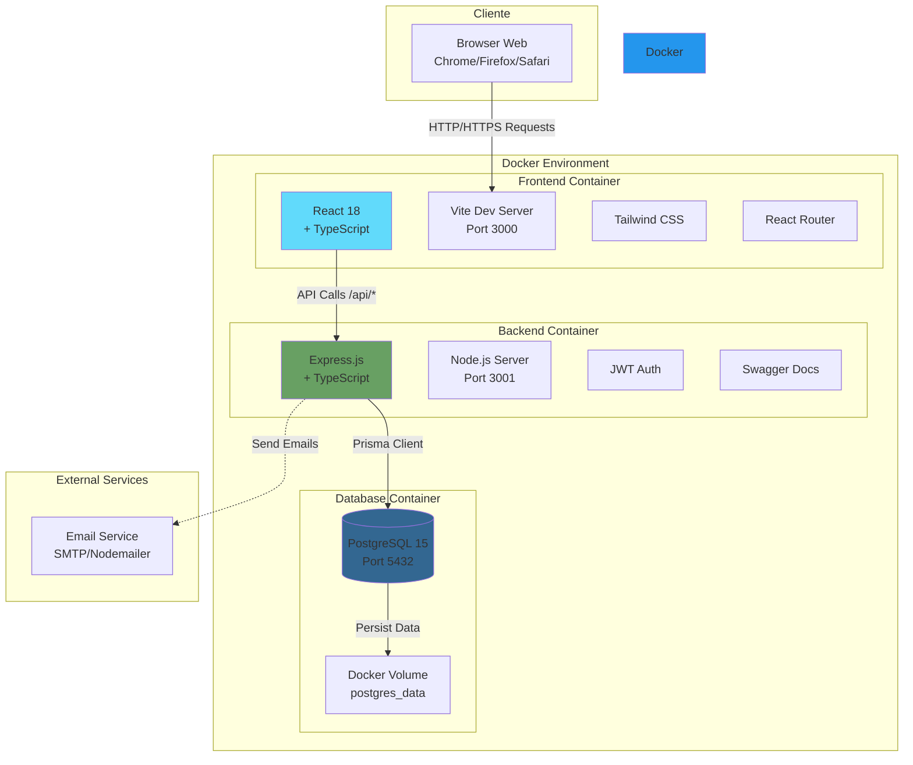
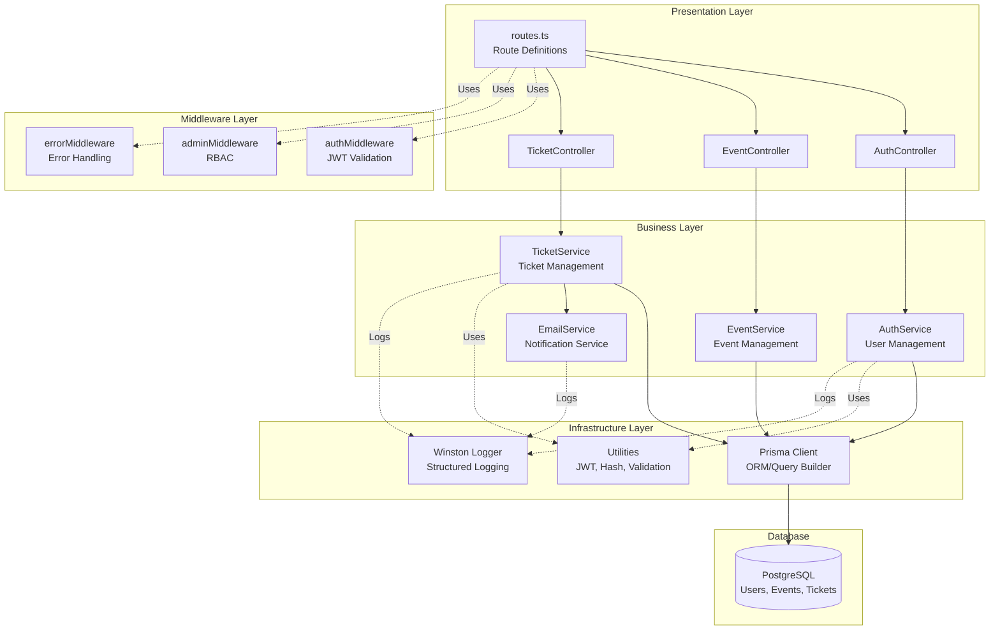
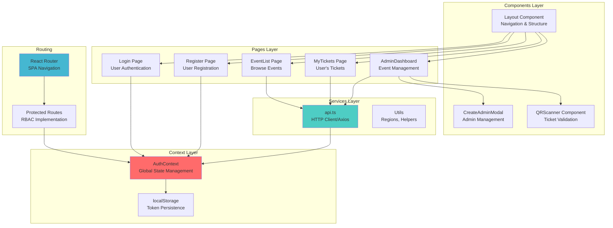
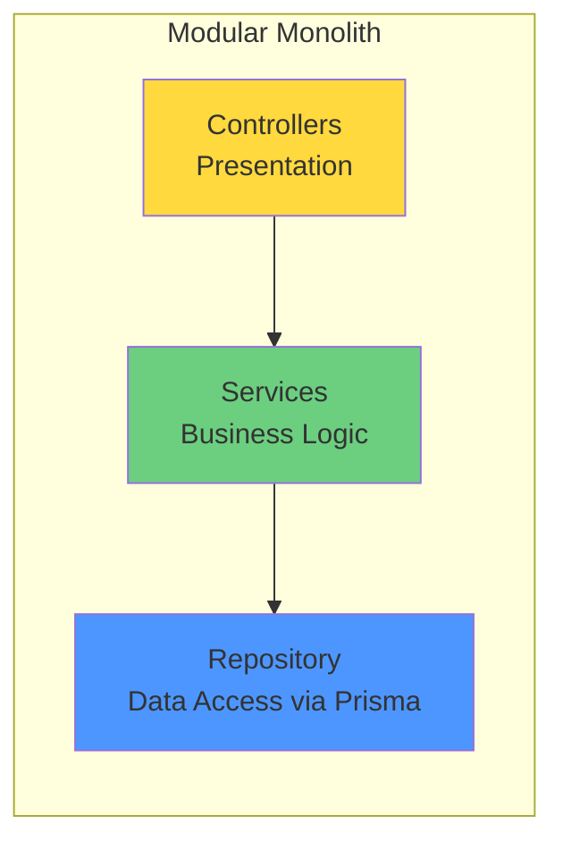
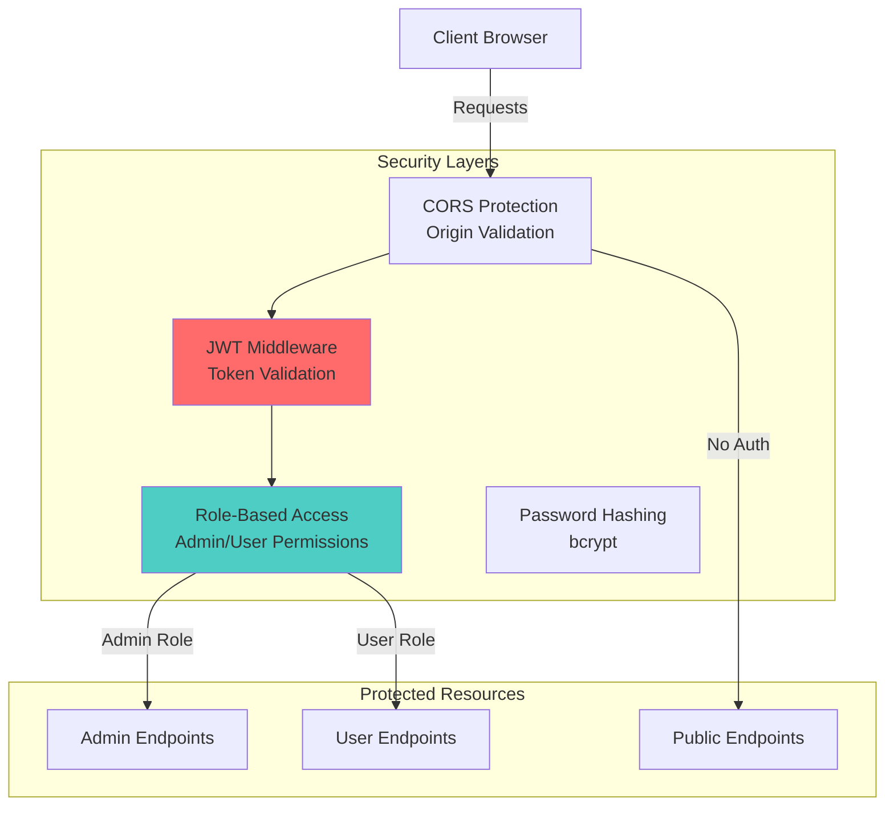

# Diagrama de Arquitetura

## Visão Geral da Arquitetura do EventPass

### Arquitetura de Alto Nível

### Arquitetura Interna do Backend

### Arquitetura Interna do Frontend

## Padrões Arquiteturais Implementados

### 1. Monolito Modular (Backend)

### 2. Microservices-Ready Structure
- **Separação clara de responsabilidades** por domínio (Auth, Events, Tickets)
- **Services independentes** podem ser extraídos facilmente
- **Database per service** pattern preparado (cada entidade isolada)

### 3. Security Architecture

## Características Técnicas

### Containerização
- **Docker Compose**: Orquestração completa do ambiente
- **Multi-stage builds**: Otimização de imagens para dev/prod
- **Volume persistence**: Dados do PostgreSQL persistidos
- **Network isolation**: Rede interna para comunicação entre containers

### Tecnologias utilizadas

**Frontend Stack:**
- React 18 com TypeScript
- Vite (build tool e dev server)
- Tailwind CSS (styling)
- React Router (roteamento)
- Axios (HTTP client)

**Backend Stack:**
- Node.js com Express.js
- TypeScript (type safety)
- Prisma ORM (database abstraction)
- JWT (autenticação stateless)
- Swagger (documentação de API)
- Winston (logging estruturado)

**Infrastructure:**
- PostgreSQL 15 (banco relacional)
- Docker & Docker Compose (containerização)
- Volume persistence (dados)

### Princípios de Design

1. **Separation of Concerns**: Cada camada tem responsabilidade específica
2. **Dependency Injection**: Services injetados nos controllers
3. **Transaction Safety**: Operações críticas em transações atômicas
4. **Error Handling**: Middleware centralizado para tratamento de erros
5. **Type Safety**: TypeScript em toda a aplicação
6. **Stateless Authentication**: JWT para escalabilidade horizontal