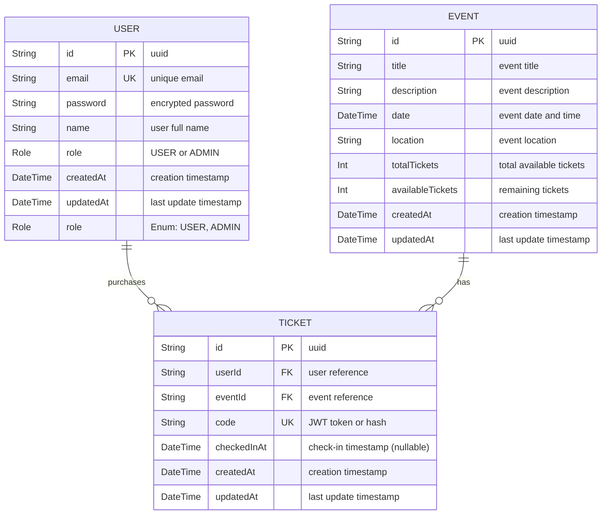

# Diagrama de Entidade-Relacionamento (DER)

## Modelo de Dados do EventPass

Este diagrama representa as entidades principais do sistema EventPass e seus relacionamentos.

## Descrição das Entidades

### USER
- **Propósito**: Representa os usuários do sistema (compradores e administradores)
- **Campos principais**:
  - `role`: Define se é usuário comum ou administrador
  - `email`: Único no sistema, usado para autenticação
  - `password`: Armazenado de forma criptografada

### EVENT
- **Propósito**: Representa os eventos disponíveis para compra de ingressos
- **Campos principais**:
  - `totalTickets`: Capacidade total do evento
  - `availableTickets`: Ingressos ainda disponíveis (decrementado a cada compra)

### TICKET
- **Propósito**: Representa a relação entre usuário e evento (ingresso comprado)
- **Campos principais**:
  - `code`: Token JWT único para validação do ingresso
  - `checkedInAt`: Timestamp do check-in (null = não fez check-in)
  - Constraint única: um usuário só pode ter um ingresso por evento

## Regras de Negócio Implementadas

1. **Um usuário por evento**: Constraint `@@unique([userId, eventId])` impede múltiplos ingressos
2. **Controle de disponibilidade**: Campo `availableTickets` é decrementado atomicamente
3. **Segurança**: Códigos dos ingressos são tokens JWT assinados
4. **Auditoria**: Todos os registros têm timestamps de criação e atualização