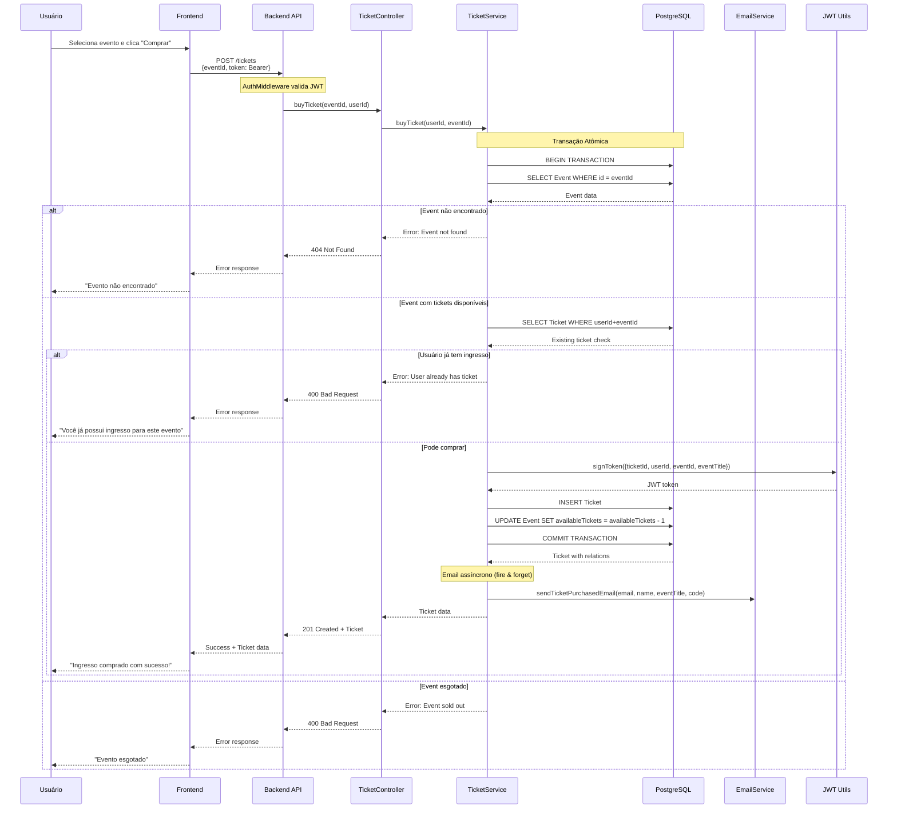
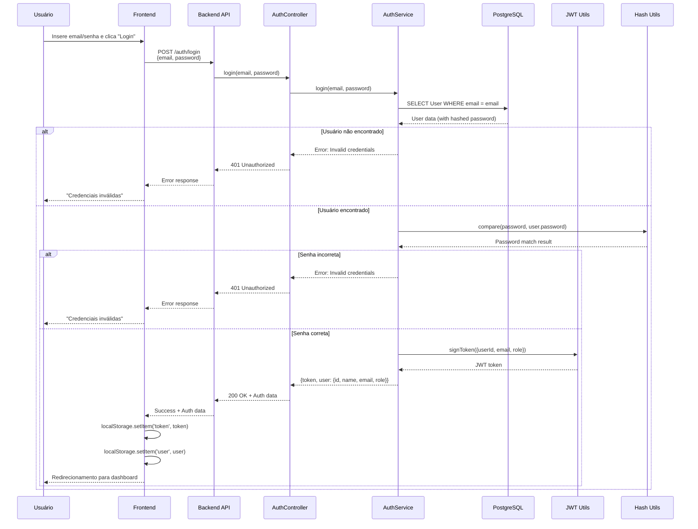
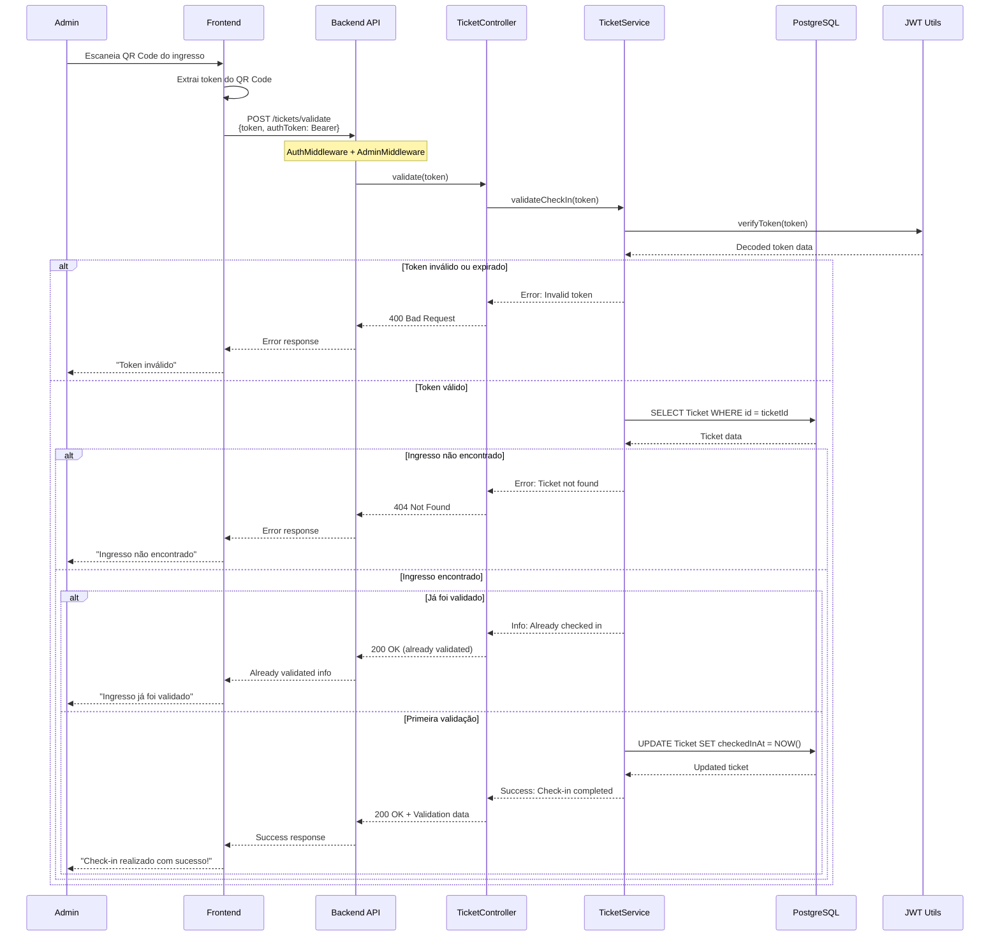

# Diagramas de Sequência

## Fluxos Principais do EventPass

### 1. Fluxo de Compra de Ingresso

Este diagrama mostra o processo completo de compra de um ingresso, incluindo validações e controle de concorrência.

### 2. Fluxo de Autenticação (Login)

### 3. Fluxo de Validação de Ingresso (Check-in)

## Características dos Fluxos

### Segurança
- Todos os endpoints protegidos requerem token JWT válido
- Operações administrativas requerem role ADMIN
- Tokens de ingresso são JWT assinados com informações do evento

### Concorrência
- Compra de ingressos usa transações atômicas para evitar overselling
- Controle de disponibilidade é feito no nível de banco de dados

### Experiência do Usuário
- Emails de confirmação enviados de forma assíncrona
- Feedback claro para todos os cenários de erro
- Validação de ingressos com QR Code para facilidade de uso